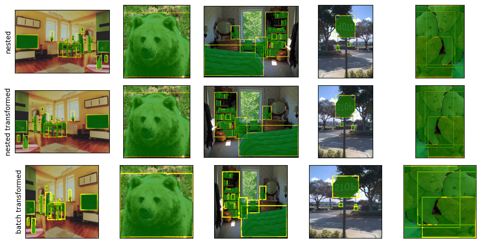

# COCO dataset example using nested tensors

## Introduction

In this example, we will show you how to perform transformations for object detection using **Torchaug** through:
- **batch tensors** that stacks images, boxes and masks. This can only be used when images are of the same shape which requires former resizing.
- **nested tensors** which list images, boxes and masks. They can be used freely even if images have different sizes.
We also make comparison with Torchvision that cannot handle batch transforms or nested tensors natively.

## Set Up

### Imports

Here we import all the required modules for the notebook.

```python
import pathlib
import random

import matplotlib.pyplot as plt
import numpy as np
import torch
from torch.utils.data import DataLoader
from torchvision import datasets
from torchvision.utils import draw_bounding_boxes, draw_segmentation_masks

from torchaug import ta_tensors
from torchaug import transforms as ta_transforms
from torchaug.data.dataloader import default_nested_collate
from torchaug.data.dataset import wrap_dataset_for_transforms_v2
from torchaug.transforms import functional as F
```

### Utils functions

Here we define utilities functions for plotting and handling various data structure.

```python
def plot(imgs, row_title=None, **imshow_kwargs):
    if not isinstance(imgs[0], list):
        # Make a 2d grid even if there's just 1 row
        imgs = [imgs]

    num_rows = len(imgs)
    num_cols = len(imgs[0])
    _, axs = plt.subplots(nrows=num_rows, ncols=num_cols, figsize=(10, 5), squeeze=False)
    for row_idx, row in enumerate(imgs):
        for col_idx, img in enumerate(row):
            boxes = None
            masks = None
            if isinstance(img, tuple):
                img, target = img
                if isinstance(target, dict):
                    boxes = target.get("boxes")
                    masks = target.get("masks")
                elif isinstance(target, (ta_tensors.BoundingBoxes)):
                    boxes = target
                else:
                    raise ValueError(f"Unexpected target type: {type(target)}")
            img = F.to_image(img)
            if img.dtype.is_floating_point and img.min() < 0:
                # Poor man's re-normalization for the colors to be OK-ish. This
                # is useful for images coming out of Normalize()
                img -= img.min()
                img /= img.max()

            img = F.to_dtype(img, torch.uint8, scale=True)
            if boxes is not None:
                img = draw_bounding_boxes(img, boxes, colors="yellow", width=3)
            if masks is not None:
                img = draw_segmentation_masks(img, masks.to(torch.bool), colors=["green"] * masks.shape[0], alpha=0.65)

            ax = axs[row_idx, col_idx]
            ax.imshow(img.permute(1, 2, 0).numpy(), **imshow_kwargs)
            ax.set(xticklabels=[], yticklabels=[], xticks=[], yticks=[])

    if row_title is not None:
        for row_idx in range(num_rows):
            axs[row_idx, 0].set(ylabel=row_title[row_idx])

    plt.tight_layout()


def uncollate_batch(batch):
    imgs = batch[0]
    targets = batch[1:][0]
    decollate_imgs = imgs.to_samples()
    for key, elems in targets.items():
        if key == "boxes":
            decollate_bbox = elems.to_samples()
        elif key == "masks":
            decollate_mask = elems.to_samples()
        elif key == "labels":
            decollate_labels = elems.to_samples()

    decollate = [
        (
            decollate_imgs[i],
            {
                "boxes": decollate_bbox[i],
                "masks": decollate_mask[i],
                "labels": decollate_labels[i],
            },
        )
        for i in range(len(decollate_imgs))
    ]

    return decollate


def uncollate_nested_batch(batch):
    imgs = batch[0]
    targets = batch[1:][0]
    decollate_imgs = imgs.to_list()
    for key, elems in targets.items():
        if key == "boxes":
            decollate_bbox = elems.to_list()
        elif key == "masks":
            decollate_mask = elems.to_list()
        elif key == "labels":
            decollate_labels = elems.to_list()

    decollate = [
        (
            decollate_imgs[i],
            {
                "boxes": decollate_bbox[i],
                "masks": decollate_mask[i],
                "labels": decollate_labels[i],
            },
        )
        for i in range(len(decollate_imgs))
    ]

    return decollate
```

### Dataset creations

Configurate paths for the COCO dataset.
```python
ROOT = pathlib.Path("your_path") / "coco"  # replace by your path
IMAGES_PATH = str(ROOT / "val2017")
ANNOTATIONS_PATH = str(ROOT / "annotations" / "instances_val2017.json")
```

We define the dataloaders for **nested tensors** that do not require resizing:
```python
torchaug_nested_dataset = datasets.CocoDetection(IMAGES_PATH, ANNOTATIONS_PATH, transforms=None)
torchaug_nested_dataset = wrap_dataset_for_transforms_v2(
    torchaug_nested_dataset, target_keys=("boxes", "labels", "masks")
)
torchaug_nested_dataloader = DataLoader(torchaug_nested_dataset, batch_size=5, collate_fn=default_nested_collate)
```

### Transform batch

We define two transforms:
1. random horizontal flip
2. random horizontal flip followed by a resize and the nested tensors are converted to batch tensors.
```python
seed = 203  # set seed for reproducibility

nested_transform_flip = ta_transforms.SequentialTransform([ta_transforms.RandomHorizontalFlip(0.5)])
nested_transform_total = ta_transforms.SequentialTransform(
    [ta_transforms.RandomHorizontalFlip(0.5), ta_transforms.Resize([224, 224]), ta_transforms.NestedToBatch()]
)
batch_nested = next(iter(torchaug_nested_dataloader))
batch_nested = (
    batch_nested[0],
    {
        "boxes": batch_nested[1]["boxes"],
        "labels": batch_nested[1]["labels"],
        "masks": batch_nested[1]["masks"],
    },
)

torch.manual_seed(seed)
random.seed(seed)
np.random.seed(seed)
nested_transformed_flip = nested_transform_flip(batch_nested)
print(
    "Nested output types: (",
    type(nested_transformed_flip[0]).__name__,
    {k: type(v).__name__ for k, v in nested_transformed_flip[1].items()},
    ")",
)

torch.manual_seed(seed)
random.seed(seed)
np.random.seed(seed)
nested_transformed_total = nested_transform_total(batch_nested)
print(
    "Batch output types: (",
    type(nested_transformed_total[0]).__name__,
    {k: type(v).__name__ for k, v in nested_transformed_total[1].items()},
    ")",
)

uncollated_batch_nested = uncollate_nested_batch(batch_nested)

nested_transformed_flip = uncollate_nested_batch(nested_transformed_flip)
nested_transformed_total = uncollate_batch(nested_transformed_total)

>>> Nested output types: ( ImageNestedTensors {'boxes': 'BoundingBoxesNestedTensors', 'labels': 'LabelsNestedTensors', 'masks': 'MaskNestedTensors'} )
>>> Batch output types: ( BatchImages {'boxes': 'BatchBoundingBoxes', 'labels': 'BatchLabels', 'masks': 'BatchMasks'} )
```

## Visualization

```python
plot(
    [
        [uncollated_batch_nested[i] for i in range(5)],
        [nested_transformed_flip[i] for i in range(5)],
        [nested_transformed_total[i] for i in range(5)],
    ],
    row_title=["nested", "nested transformed", "batch transformed"],
)
```

